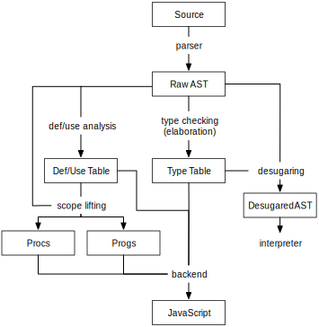

title: Static Staging Compiler Implementation
[INCLUDE="docs.mdk"]

[TITLE]

This is the documentation for the static staging compiler (&proj;) implementation.
You may also be interested in the [language documentation](index.html).

[TOC]

# Build and Run

To get the compiler running, install [Node][] and [npm][]. Then, on Unix, just type `make` to install the dependencies and build the project. Or you can run these commands manually:

    $ npm install
    $ npm run build

Then, you can install the `&tool;` command-line program by typing:

    $ npm link

To make sure it's working, you can try running an example:

    $ &tool; test/basic/add.atw

[npm]: https://www.npmjs.com/
[Node]: https://nodejs.org/

## Command Line

Type `&tool; -h` for usage. The most important options are:

* `-c`: Use the compiler to JavaScript. Otherwise, the interpreter is used instead. By default, this dumps the compiled JavaScript code to the standard output.
- `-x`: When in compiler mode, run the resulting JavaScript code with `eval` and print the output. Together, `-cx` should give you the same output as running the interpreter (with no options at all).
- `-w`: Use the WebGL language extension. (Only valid in compiler mode.)

There's also `-v` for debugging output and `-g` for program generation, as described in the language overview.

## Web Dingus

There's also an interactive browser frontend. On Unix, just type `make` in the `dingus` directory, or otherwise use the same `npm run build` dance. Then, open `index.html` in your browser.

The dingus seems to work in current versions of Safari, Firefox, Chrome, and Microsoft Edge.

# Compiler Architecture

~ Figure { caption: "The primary data structures in &proj;." }
{ width: 400px; }
~

The main phases in the compiler are:

* Parsing, which produces the raw AST.
* Type elaboration and desugaring, which produces a high-level IR in the form of an annotated AST (or a type error). This IR can be passed off to the interpreter.
* A set of semantic analysis passes, which produce a mid-level IR. This IR consists of a collection of data structures *on the side* of the unmodified AST.
* The backend, which produces JavaScript (and GLSL) from the IR.

This section gives more overview on how the pieces go together. The latter sections give more detail on the more novel components work.

The *driver* in [`driver.ts`][driver] orchestrates the whole process, so it's useful as a way into the whole system.

[driver]: https://github.com/sampsyo/alltheworld/blob/master/src/driver.ts

## Parser

The parser uses a popular [parsing expression grammar][peg] parser-generator library called [PEG.js][].
The [grammar][] produces an AST as a JSON data structure, which is specified in [`ast.ts`][ast].

All the other IRs in the compiler are based on variants of this JSON AST, and the major components all dispatch on the tags to recursively process the tree.

[ast]: https://github.com/sampsyo/alltheworld/blob/master/src/ast.ts
[grammar]: https://github.com/sampsyo/alltheworld/blob/master/src/grammar.pegjs
[peg]: https://en.wikipedia.org/wiki/Parsing_expression_grammar
[peg.js]: http://pegjs.org/
[dingus]: http://adriansampson.net/atw/

## Type Checking and Elaboration

To turn the raw parse tree to a more useful IR, we attach sequential numeric IDs to every node in the AST (see the `stamp` function in [`type_elaborate.ts`][elaborate]).
This lets us build tables that decorate the AST with extra information.

The [type checker][check] runs next.
It works as a type *elaborator:* it produces a table mapping node IDs to `TypeEnv` structures that capture the entire type information at every point.

[elaborate]: https://github.com/sampsyo/alltheworld/blob/master/src/type_elaborate.ts
[check]: https://github.com/sampsyo/alltheworld/blob/master/src/type_check.ts

## Desugaring

Two features in the language are implemented as [syntactic sugar][sugar]:

* For the *interpreter*, cross-stage references are sugar for materialization (a.k.a. persisting) escapes. That is, `var x = 5; <x>` is sugar for `var x = 5; <%[x]>`. This way, the interpreter does not need any special logic to implement cross-stage references. We do not enable this desugaring for the compiler;  it handles free variables specially for efficiency.

* Macro calls are sugar for escaped function invocations. The `desugar_macros` function eliminates all `MacroCall` nodes into of spliced function calls. This is used for both the compiler and the interpreter.

Both desugaring steps require type information, so they use the results from type elaboration.

[sugar]: https://github.com/sampsyo/alltheworld/blob/master/src/sugar.ts

## Semantic Analysis and IR

The compiler uses an IR consisting of the result of several semantic analyses. See [`compile/ir.ts`][ir] for an exhaustive look at the contents of this IR and [`compile/compile.ts`][compile] for the `semantically_analyze` megafunction that produces the `CompilerIR`.

Here are a few of the most interesting pieces of the IR:

- `Proc` and `Prog` objects are "lifted" forms of functions and quotes, respectively. Both are subtypes of `Scope`. A process called *scope lifting*, which generalizes [lambda lifting][], finds the free variables and escapes to attribute to each scope.
- A *definition--use table* keeps track of the defining expression for every variable reference.
- The *pre-splicing* optimization described in the table produces a set of `Variant` objects for each quote with snippet escapes. The backends use these specific, pre-composed variants instead of the original `Prog`s.

[lambda lifting]: https://en.wikipedia.org/wiki/Lambda_lifting
[compile]: https://github.com/sampsyo/alltheworld/blob/master/src/compile/compile.ts
[ir]: https://github.com/sampsyo/alltheworld/blob/master/src/compile/ir.ts

## Backends

There are three backends: [`js.ts`][js] emits "vanilla" JavaScript; [`glsl.ts`][glsl] emits pure GLSL code; and [`webgl.ts`][webgl] extends the JavaScript backend with WebGL-specific intrinsics and invokes the GLSL backend to emit shaders.

All three backends share an [`Emitter` structure][emitter] that holds the functions for generating code from IR structures.

There's also a [`gl.ts`][gl] source file with common logic shared by the GLSL backend and the higher-level WebGL backend.
The most important bit here is the `Glue` object, which keeps track of a bunch of metadata for values that are communicated between shader stages.
For example, `Glue` records the OpenGL name of the parameter to use for communication and a flag indicating whether the value is an attribute (i.e., an array).

[js]: https://github.com/sampsyo/alltheworld/blob/master/src/backends/js.ts
[glsl]: https://github.com/sampsyo/alltheworld/blob/master/src/backends/glsl.ts
[webgl]: https://github.com/sampsyo/alltheworld/blob/master/src/backends/webgl.ts
[emitter]: https://github.com/sampsyo/alltheworld/blob/master/src/backends/emitter.ts
[gl]: https://github.com/sampsyo/alltheworld/blob/master/src/backends/gl.ts

# Scope Lifting

[Lambda lifting][] is the standard technique for compiling languages with closures.
&proj; generalizes lambda lifting to apply to both functions and quotes simultaneously.
The compiler calls the combined transformation *scope lifting*.

The idea behind lambda lifting is to take every function and turn it into a *procedure* that doesn't close over any state---all of its parameters must be provided explicitly rather than picked up from the surrounding environment.
Procedures are placed in a global namespace, like C functions, and get extra parameters for every value they reference in their environment.
Function definition nodes are transformed to produce *closure values*, which consist of a procedure pointer and an environment mapping that holds values to pass to the procedure when it is called.

Quote lifting has a similar goal: extract all the quotes mixed into a program and turn them into global constants.
(Think of them as strings embedded in the `.text` section of an executable binary.)
Quote expressions also need to produce a closure-like value: they also consist of a pointer to the code and an environment---the environment contains the materialized outer-stage values.

General scope lifting recognizes that functions and quotes are nearly identical. Quotes don't have arguments and functions don't have escapes, but those are the only real differences. &proj;'s scope lifting pass finds free and bound variables in a uniform way for both kinds of scopes.

## Materialization Generalizes Free Variables

To compile materialization escapes and free variables in quotes, &proj;'s quote-lifting analysis generalizes the concept of free variables in functions.
As an example, this program uses a materialization inside of a function body:

    var y = 2;
    !<
      let f = fun x:Int -> x * %[y + 1];
      f 3
    >

After scope lifting, we should have a function contained in a string literal. In &proj;'s JavaScript backend, this looks something like:

    var prog1 =
    "function func1(x, persist1) {" +
    "  return x * persist1;" +
    "}" +
    "func1(3, persist1)";
    var y = 2;
    eval(prog1, persist1: y + 1);

Specifically, the persisted value (here, `persist1`) must become *part of the quoted function's environment*.
The same logic applies as for free variables: a reference to `y` in the function's body would this imply `y` is a free variable for the function, and thus require inclusion in the function's closure environment.

The conclusion is that you can view materialization escapes as a reference to a free variable, where the free variable is defined just before the quote. A program with a materialization escape:

    < ... %[ expr ] ... >

is equivalent to one with a free variable reference to a temporary:

    var temp = expr;
    < ... temp ... >

# Splicing

To implement splicing, we need to be able to combine two program values at run time.
Specifically, we need to have a runtime available with a *splice* operation that takes as input an outer program, an inner program, and an indication of where to splice the latter into the former.
The operation needs to combine the persisted values associated with both programs to produce a new mapping with their union.

In our JavaScript backend, this splicing works by string interpolation.
Every escape in a quote becomes a special token like `__SPLICE_21__`; we use `String.replace` to stitch in the spliced code at the right token.
Materialization maps can be combined by taking the union of the two component name maps.

## Splicing and Functions

Lambda lifting and quote lifting are intertwined---they can't be performed separately.
For example, this program uses an escape inside of a function definition:

    var x = <5>;
    var f = !< fun y:Int -> y + [x] >;
    f 2

This only works if the function is defined *inside* a quotation so it can be spliced into.

In a homogeneous environment, where all code is compiled to the same language, the opposite direction is not a problem. This program defines a function outside a quote and then uses materialization to call it inside a quote:

    var f = fun x:Int -> x * 2;
    !< %[f] 3 >

The closure value named `f` can stick around to be used when the quote is executed.
In a heterogeneous target (e.g., JavaScript + GLSL), though, this won't work: you can't take a function defined in language A and call it in language B without an FFI.
And in our scenario, it's even worse: the programs run on different hardware with different ISAs.
For that scenario, we probably want to explore compiling those outer functions *twice*, once for each target, so they can be used in both places.

## Multi-Level Escapes

Our language extends traditional multi-stage programming with $n$-level escapes. An escape written `[e]n` or `%[e]n` evaluates the expression `e` in the context that is $n$ levels up from the current quote.

Consider this small example:

    var c = <5>;
    !<!< [c]2 + 4 >>

There are three stages here: the outer stage and two nested quotes. The splicing needs to happen at the first, outermost stage---the generated code should not do any splicing in the latter stages. That is, we need to emit JavaScript code that looks like this:

    var prog1 = "
      var prog2 = \"
        __SPLICE__ + 4
      \";
      eval(prog2);
    ";
    eval(prog1.replace("__SPLICE__", "5"));

In particular, the string literal for the inner quote needs to appear *nested inside* the string for the outer quote. It won't work to hoist all the programs to the top-level namespace (as an earlier version of the &proj; compiler would have):

    var prog1 = "eval(prog2)";
    var prog2 = "__SPLICE__ + 4";

because this would make it impossible to splice into `prog2`'s text when preparing prog1 for evaluation.

Incidentally, the correct nesting for $n$-level escapes also makes it possible to *residualize* programs. Since a quote contains everything it needs to execute, it is possible to write the program to a file and execute it later.

The correct nesting is also simpler to explain: each quote in the output is a self-contained, complete program. Generating code for a quotation amounts to a recursive invocation of the entire compiler. When &proj; eventually grows a native-code backend, this will manifest as emitting a complete `.text` section for the subprogram's binary. We could consider an optional quotation mode that leads to more efficient in-process execution but prevents residualization by returning to the "hoisted" behavior, where all subprograms are linked into the main program's `.text` section.

# Emitting JavaScript

This section is about the JavaScript backend.

## Code Values

Code values in the JavaScript backend are objects containing the code pointer (`prog`) and the materialization environment (called `persist` for historical reasons). For example, [this example program][splice]:

    var x = 5;
    !< 37 + %[x] >

compiles to JavaScript that looks roughly like this (stripping away the details):

    var q4 = "... 37 + p7 ...";
    var v1 = 5;
    var code = { prog: q4, persist: { p7: v1 } };
    run(code);

Note that the quotation gets compiled to a global string, `q4`.
The runtime function `run` binds the materialized names (i.e., `p7`) and calls `eval`.

[splice]: http://adriansampson.net/atw/#code=var%20x%20%3D%205%3B%0A!%3C%2037%20%2B%20%25%5Bx%5D%20%3E

## Expression Chains

If you experiment with the compiler, you'll notice that the output JavaScript doesn't use very many semicolons---it uses commas instead.
That's because was easier to chain *expressions* in the backend than to use a series of *statements*.
So [this tiny program][exprs]:

    var x = 5;
    var y = 9;
    x + y

compiles to:

    (function () {
      var v4, v1;
      return v1 = (5),
      v4 = (9),
      (v1) + (v4);
    })()

where the three expressions are chained with commas after the `return` keyword.
The `var` line pre-declares all the variables that we use in the code to make them into local JavaScript variables.

[exprs]: http://adriansampson.net/atw/#code=var%20x%20%3D%205%3B%0Avar%20y%20%3D%209%3B%0Ax%20%2B%20y

## `extern`

To make the language slightly more practical, I've I added an `extern` expression. It lets you declare values without defining them. This way, in the JavaScript backend, you can use plain JavaScript functions from your &proj; program. [For example:][extern]

    extern Math.pow: Int Int -> Int;
    Math.pow 7 2

That program compiles to code that invokes JavaScript's own `Math.pow` by wrapping it in an &proj; closure value:

    var closure = ({ proc: Math.pow, env: [] });
    var args = [(7), (2)].concat(closure.env);
    return closure.proc.apply(void 0, args);

[extern]: http://adriansampson.net/atw/#code=extern%20Math.pow%3A%20Int%20Int%20-%3E%20Int%3B%0AMath.pow%207%202

Unlike ordinary variables, `extern`s are "ambient": they're available at all (subsequent) stages without the need for materialization.

The compiler infrastructure also a has a notion of intrinsics, which are just externs that are implicitly defined. For example, `vtx` and `frag` are both intrinsics that get special handling in the WebGL/GLSL compiler. The output variables of shaders, `gl_Position` and `gl_Color`, are also intrinsics but don't get any special handling. To make this work, I had to add special rules for *mutating* externs. That way, an expression like this:

    gl_Color = x

generates code that actually assigns to the variable `gl_Color` defined in the target. (An ordinary mutation would update a new variable generated by the compiler.)

## Function Quotes { #fquote }

When splicing is not required, `eval` shouldn't be required either---all the code can be emitted ahead of time.
The compiler supports *function quotes*, annotated like `js< ... >`, that get compiled as plain JavaScript functions instead of strings.
Splice escapes are not allowed in these quotes, but materialization still is.

# The WebGL Backend

These are some extensions to the core compiler for the graphics variant.

## Choosing the Target Language

The compiler needs some way to decide what is host code and what is shader code so it can be compiled to the correct language.
There are two obvious options:

1. Count the number of nested angle brackets \<\> and switch backends at some threshold.
2. Use an annotation to mark shader code.

I have gone with option 2, which makes it possible to put shader code by itself in a function and invoke it elsewhere. You write `glsl< ... >` to generate GLSL code.
The type system is also aware of annotations: for example, you will get an error if you try to use a quote that's compiled as JavaScript with the `vertex` intrinsic.

## Render Stage and Unmetaprogrammed Quotes

The language also needed a way to separate one-time setup code from the host-side code that gets executed on every frame. This is another perfect match for staging---clearly, the same issues of persistence and deferral arise. So we use a "render" stage, which must be a [`js<...>` function quote][#fquote] that emits JavaScript code that draws stuff.

## Declaring In/Out Variables

GLSL uses explicit `in` and `out` type qualifiers (or, in WebGL version 1, the more arcane `attribute`, `uniform`, and `varying` qualifiers). These qualifiers indicate communication between stages. To generate these declarations, the compiler uses the nesting structure of GLSL quotes.

The WebGL backend requires that each vertex-shader program contain exactly one nested program: the fragment shader.
When emitting the code for the vertex shader, it enumerates the materializations in the nested fragment shader and emits an `out` declaration for each.

All shader programs---vertex and fragment---get a corresponding `in` declaration for each of their escapes.

This nesting-based strategy requires, currently, that you transition to fragment shading using a *literal* quote. That is, your code has to look like this:

    var shader = glsl<
      # vertex code here
      fragment glsl<
        # fragment code here
      >
    >

But you *cannot* assign the fragment shader to a variable:

    var shader = glsl<
      # ...
      var fragment_shader = fragment glsl<
        # ...
      >
      # ...
      fragment fragment_shader
    >

This way, we know *statically* which variables need to be passed to support all the materializations in the inner program.

## GLSL Types

The WebGL backend adds primitive types for vectors and matrices. (They are called by the sensible HLSL-like names `Float3`, `Int4x4`, etc., but have OpenGL-like aliases like `Vec3` and `Mat4`.) It uses these types in the definition of its intrinsics.

See [`gl.ts`][gl] for the type declarations and aliases.

## Attributes

To define attributes, the compiler uses a limited form of polymorphic type constructors. For the gory details, see `ConstructorType` and `InstanceType` from [`type.ts`][type].

[type]: https://github.com/sampsyo/alltheworld/blob/master/src/type.ts

These type constructors let you declare values of type `T Array` where `T` is some other type.
For the moment, user code can't construct and destruct these types---doing so would require something like full Hindley--Millner type inference.

The trick for attributes is that we type and compile cross-stage persistence differently in the for `T Array`s. That is, a program like this:

    extern buf: Float3 Array;
    glsl<
      let val = buf
    >

gives `val` the type `Float3`, not `Float3 Array` as it would normally. This array-to-element "degrading" only occurs when crossing the boundary into a shader stage (one marked with the `glsl` annotation). We also generate the code differently to communicate an attribute instead of a uniform.
See `Glue` from [`gl.ts`][gl].

I also considered an alternative design where you would need to use an explicit function, like `cur a`, to project an array to a single element inside a quote. This had two downsides:

* The `cur` function would need the polymorphic type `'a Array -> 'a`, so we'd need something closer to full Hindley--Millner. A custom type rule was simpler for this specific case.
* Since you can't communicate an entire array from the CPU to GPU anyway, you would *always* need to use `cur`. It would be redundant from the programmer's perspective, because whether you want `a` or `cur a` is entirely dictated by the context anyway.
